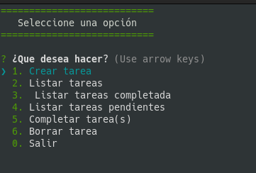

# Aplicacion de consola interactiva 👨‍💻

Una aplicacion de lista de tareas corriendo en NodeJs.



### **Instalacion 🔑**
```bash
git clone git@github.com:VICDUR/Aplicacion-consola-interactiva.git

cd Aplicacion-consola-interactiva

npm i or npm install
```

### **Start** 💻
```bash
npm run app
```

